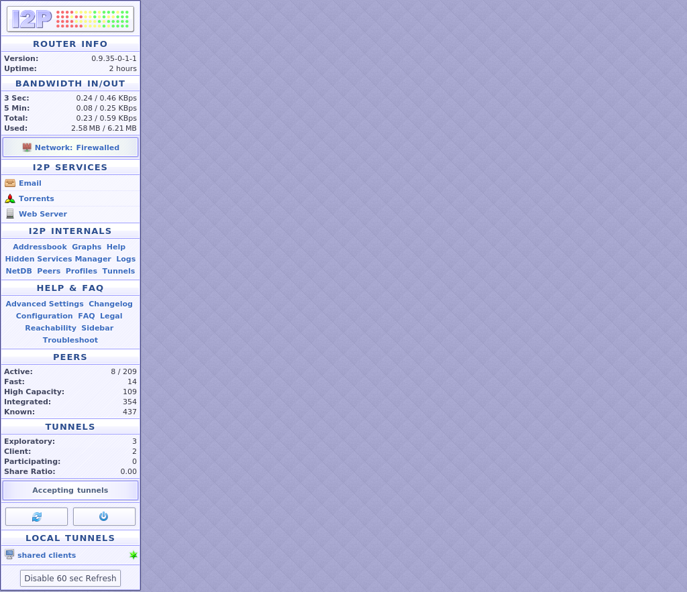
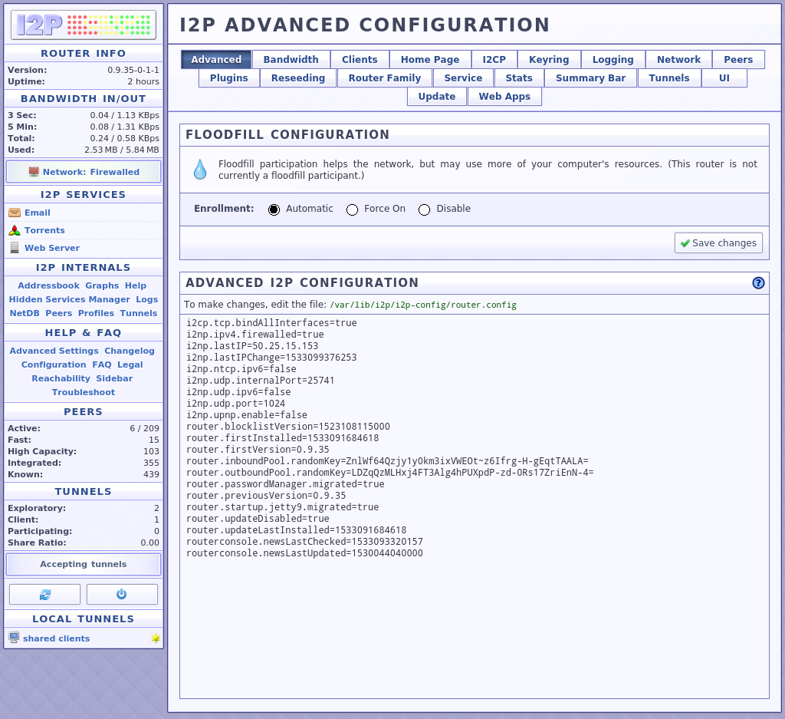
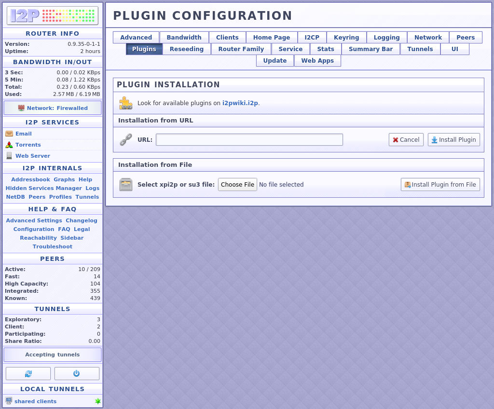
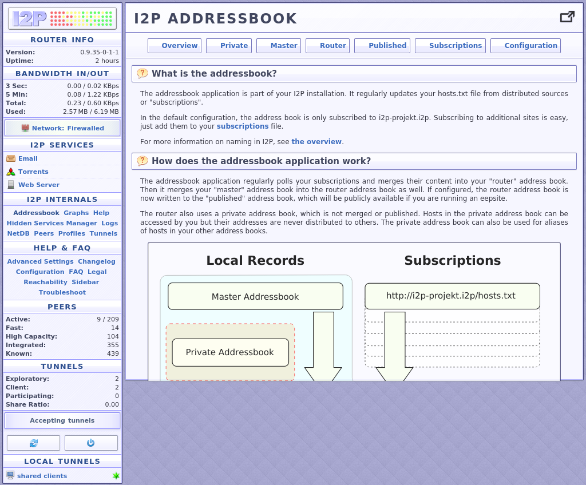

SCREENSHOTS
===========

 * 

 * 

 * 

 * 

 * 

 * 

 * 

 * 

 * 

 * 

 * 

 * 

 * 

 * 

 * 

 * 

 * 

 * 

 * 

 * 

 * 

 * 

 * 

 * 

 * 

 * 

 * 

 * 

 * 

 * 

 * 

 * 

 * 

 * 

 * 

 * 

 * 

 * 

 * 

 * 

 * 

 * 

 * 

 * 

 * 

 * 

 * 

 * 

 * 

 * 

 * 

 * 

